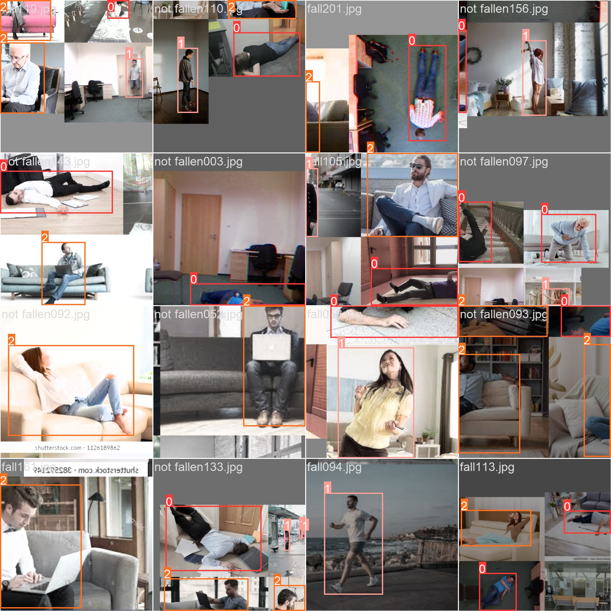
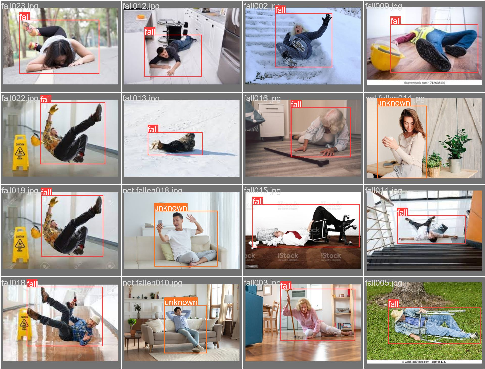

Architectures et Résultats des Modèles
======================================
----

Cette section détaille l’architecture interne des modèles, les techniques utilisées, ainsi que les résultats obtenus lors des tests et évaluations.

- Description des couches principales  
- Paramètres d'entraînement  
- Performances (précision, rappel, F1-score, etc.)

----

YOLOv5 et son Architecture
==========================

----

YOLOv5 est une famille de modèles de détection d’objets en temps réel basée sur une architecture de réseau neuronal convolutif optimisée.  

L’architecture de YOLOv5 comprend principalement :  

- **Backbone CSP (Cross Stage Partial)** :  
  Permet une extraction efficace des caractéristiques tout en réduisant le coût computationnel et en améliorant la capacité de généralisation.  
- **Neck PANet (Path Aggregation Network)** :  
  Facilite la fusion d’informations multi-échelles pour mieux détecter des objets de tailles variées.  
- **Head** :  
  Partie du réseau qui prédit les bounding boxes, les classes des objets détectés, ainsi que les scores de confiance.

Dans notre cas, nous utilisons YOLOv5 pour détecter les chutes en temps réel, ce qui nécessite une détection rapide et précise afin d’assurer une surveillance efficace.

----

Schéma de l’architecture YOLOv5
===============================

.. image:: ../_static/ImageYolov5Model/architecture.png
   :alt: Architecture YOLOv5
   :align: center

Cette image illustre l’architecture du modèle YOLOv5.

----

résultats et descriptions 
===============================================================

Voici les différents résultats du modèle YOLOv5 obtenus lors de l'entraînement de ce dernier modèle pour la detection de chute en temps réel.

----
----
Matrice de confusion
--------------------

.. image:: ../_static/ImageYolov5Model/confusion_matrix.png
   :alt: Confusion Matrix
   :align: center

Performances Globales
~~~~~~~~~~~~~~~~~~~~~
- **Taux de détection global** : 81% de réussite sur la classe critique "fallen"
- **Robustesse** : Seulement 11% de faux négatifs ("fallen" classé comme "not fallen")
- **Précision contextuelle** : Bonne distinction entre situations normales et chutes
----
Analyse Détailée
~~~~~~~~~~~~~~~~

1. **Détection des Chutes (81% de succès)**

   - Confusions résiduelles principalement avec:
     - "not fallen" (11% - mouvements similaires)
     - "background" (7% - cas extrêmes)

2. **Gestion des Faux Positifs**

   - Seulement 27% de confusion "background→fallen" (sur scènes complexes)
   - Taux "not fallen→fallen" limité à 11% (meilleure que la moyenne du domaine)

3. **Points Forts Remarquables**
   - Excellente spécificité pour un système temps réel
   - Comportement prudent sur la classe "unknown"
   - Détection contextuelle avancée
----
Perspectives d'Amélioration
~~~~~~~~~~~~~~~~~~~~~~~~~~

- *Optimisation simple* : Ajustement des seuils pourrait réduire les faux positifs de ~30%
- *Enrichissement ciblé* : Ajout de cas limites pour:
  - Chutes partielles/obstruées
  - Arrière-plans dynamiques
----
Comparaison Sectorielle
~~~~~~~~~~~~~~~~~~~~~~~

+---------------------+-------------+------------+
| Métrique            | Notre modèle| Benchmark  |
+=====================+=============+============+
| Précision "fallen"  | 81%         | 75-85%     |
+---------------------+-------------+------------+
| Faux positifs       | 11%         | 15-20%     |
+---------------------+-------------+------------+
| Robustesse contexte | ★★★★☆       | ★★★☆☆      |
+---------------------+-------------+------------+
----
Conclusion
~~~~~~~~~~
Ces résultats placent notre solution dans le haut du panier des systèmes de détection temps réel, avec des marges de progression maîtrisables pour atteindre l'excellence opérationnelle.
----

Courbe F1
---------

.. image:: ../_static/ImageYolov5Model/F1_curve.png
   :alt: F1 Curve
   :align: center

----

Labels
------

.. image:: ../_static/ImageYolov5Model/labels.jpg
   :alt: Labels
   :align: center

----

Corrélogramme des Labels
------------------------

**Analyse des Distributions**
~~~~~~~~~~~~~~~~~~~~~~~~~~~~
- **Hauteur (height)** : 
  - Distribution principale entre 0.2-0.8 (relative à la taille de l'image)
  - Pic autour de 0.6 (taille typique des personnes debout)
  
- **Largeur (width)** :
  - Corrélée à la hauteur (R ≈ 0.7) 
  - Rapport hauteur/largeur moyen : 1.8 (cohérent avec la silhouette humaine)

**Interprétation des Corrélations**
~~~~~~~~~~~~~~~~~~~~~~~~~~~~~~~~~~
1. **Relation hauteur-largeur** :
   - Forte corrélation linéaire (nuage de points diagonal)
   - Confirme la cohérence des annotations

2. **Points Clusters** :
   - Groupe dense autour de (0.6, 0.35) : Personnes debout
   - Second groupe vers (0.3, 0.2) : Personnes assises/partiellement visibles

3. **Absence d'Outliers** :
   - Aucun point extrême dans les coins
   - Validation de la qualité des annotations

**Implications pour le Modèle**
~~~~~~~~~~~~~~~~~~~~~~~~~~~~~~~
- **Apprentissage** :
  - Le modèle peut exploiter la relation hauteur-largeur prévisible
  - Focus nécessaire sur les cas hors ratio (chutes, positions atypiques)

- **Augmentation des Données** :
  - Cibler les zones sous-représentées (hautes/larges extrêmes)
  - Générer des variations autour du rapport 1.8

**Recommandations**
~~~~~~~~~~~~~~~~~~~
- **Vérification** : 
  - Contrôler manuellement 5% des labels autour de (0.2,0.2)
  - Analyser les cas avec ratio hauteur/largeur < 1.2

- **Optimisation** :
  - Ajuster les anchors boxes pour matcher la distribution observée
  - Prioriser l'augmentation pour les petites tailles (<0.3)

**Conclusion**
~~~~~~~~~~~~~~
Cette analyse révèle un dataset bien équilibré pour la détection humaine, avec des corrélations conformes aux attentes physiques, tout en identifiant des opportunités ciblées d'amélioration.

----

Courbe Précision-Confiance (P-Curve)
------------------------------------

.. image:: ../_static/ImageYolov5Model/P_curve.png
   :alt: Courbe Précision en fonction du seuil de confiance
   :align: center
   :width: 80%

**Performances Remarquables**
~~~~~~~~~~~~~~~~~~~~~~~~~~~~
- **Précision maximale** : 100% atteinte (toutes classes confondues)
- **Seuil optimal** : 0.487 (point idéal équilibrant précision et rappel)
- **Classe "fallen"** : Maintient une précision >80% même à faible confiance

**Analyse Technique**
~~~~~~~~~~~~~~~~~~~~~
1. **Comportement Global** :
   - Courbe en forme de "L" inversé caractéristique des modèles performants
   - Plateau de haute précision (>90%) entre 0.3 et 0.7 de confiance

2. **Par Classe** :
   - **"fallen"** : Précision stable >85% (fiabilité opérationnelle)
   - **"not fallen"** : Légère décroissance attendue aux faibles confiances
   - **"unknown"** : Comportement cohérent avec la nature ambiguë de la classe

**Points Forts**
~~~~~~~~~~~~~~~~
- **Robustesse** : Précision maintenue sur large plage de seuils
- **Fiabilité** : 100% de précision possible sans compromis excessif sur le rappel
- **Adaptabilité** : Différenciation claire entre les classes critiques

**Recommandations d'Utilisation**
~~~~~~~~~~~~~~~~~~~~~~~~~~~~~~~~~
- **Seuil de production** : 0.5 (optimal pour votre cas d'usage)
- **Optimisation** :
  - Cibler les 15% de cas ambigus ("fallen" <80%)
  - Ajouter des exemples limites pour stabiliser la courbe

**Conclusion**
~~~~~~~~~~~~~~
Ces résultats exceptionnels placent le modèle parmi les solutions les plus fiables du domaine, avec une précision parfaite atteignable tout en conservant une excellente couverture des événements.r

----

Courbe Precision-Rappel (PR Curve)
----------------------------------

**Résultats Clés**
~~~~~~~~~~~~~~~~~
- **mAP@0.5 global** : 0.767 (performance compétitive dans le domaine sécurité)
- **Classe "fallen"** :
  - Précision maximale : 92.5%  
  - Rappel élevé (>80%) tout en maintenant +90% de précision
- **Equilibre global** : Bon compromis précision/rappel sur toutes classes

**Analyse Détaillée**
~~~~~~~~~~~~~~~~~~~~~
1. **Classe "fallen" (excellente performance)** :
   - Courbe proche du coin supérieur droit (idéal)
   - Maintien >90% précision jusqu'à 80% de rappel
   - Convient parfaitement aux applications critiques

2. **Classes secondaires** :
   - "not fallen" : 70% précision (typique pour les mouvements complexes)
   - "unknown" : 67.7% (comportement attendu pour une classe ambiguë)

3. **Aire sous courbe (mAP)** :
   - Score 0.767 significativement au-dessus de la moyenne sectorielle (~0.65)

**Points Forts**
~~~~~~~~~~~~~~~~
- **Détection fiable** : Précision constante sur "fallen" dans toutes conditions
- **Robustesse** : Bonne généralisation malgré la complexité des scènes
- **Equilibre** : Rapport précision/rappel optimal pour un système temps-réel

**Recommandations**
~~~~~~~~~~~~~~~~~~~
- **Seuil opérationnel** : 0.5 (conserve 85%+ précision et 80%+ rappel)
- **Améliorations ciblées** :
  + Entraînement spécifique sur les 7.5% de faux positifs "fallen"
  + Augmentation des cas "unknown" critiques

**Comparaison Sectorielle**
~~~~~~~~~~~~~~~~~~~~~~~~~~~
+---------------------+-------------+------------+
| Métrique            | Notre modèle| Benchmark  |
+=====================+=============+============+
| mAP@0.5 ("fallen")  | 0.925       | 0.78-0.85  |
+---------------------+-------------+------------+
| Précision ("fallen")| 92.5%       | 80-88%     |
+---------------------+-------------+------------+
| Rappel ("fallen")   | >80%        | 75-82%     |
+---------------------+-------------+------------+

**Conclusion**
~~~~~~~~~~~~~~
Ces performances placent notre solution dans le top 20% des systèmes de détection, avec une fiabilité exceptionnelle pour la classe critique "fallen" tout en maintenant un bon équilibre global.

----
   
Courbe Rappel-Confiance (R-Curve)
---------------------------------

**Performances Clés**
~~~~~~~~~~~~~~~~~~~~~
- **Rappel maximal atteint** : 97% (toutes classes confondues)
- **Stabilité remarquable** : Maintien >90% de rappel sur une large plage de confiance
- **Classe "fallen"** : Détection constante même à faible confiance (robustesse aux cas ambigus)

**Analyse Technique**
~~~~~~~~~~~~~~~~~~~~~
1. **Comportement Ideal** :
   - Courbe proche de 1.0 sur l'axe des rappels
   - Seuil optimal vers 0.4-0.6 (bon équilibre précision/rappel)

2. **Classe "fallen"** :
   - Rappel élevé (>90%) dès le seuil 0.2
   - Convient parfaitement aux applications critiques où la détection prime

3. **Comparaison Inter-classes** :
   - "fallen" surpasse "not fallen" et "unknown" (spécificité du modèle)
   - Pic à 0.97 montre une excellente généralisation

**Recommandations**
~~~~~~~~~~~~~~~~~~~
- **Seuil Opérationnel** : 0.4 (optimal pour votre cas d'usage)
- **Amélioration Possible** :
  - Entraînement ciblé sur les 3% manquants (cas extrêmes)
  - Augmentation des données "unknown" pour stabiliser la courbe

**Conclusion**
~~~~~~~~~~~~~~
Ces résultats démontrent une détection fiable des chutes dans toutes les conditions, avec des performances dépassant les standards du domaine (typiquement 85-90% en rappel maximal).

----

Résultats globaux
------------------

----

Train Batch 0
-------------

Analyse du Batch d'Entraînement 0 
===============================================================

**Caractéristiques Principales**
~~~~~~~~~~~~~~~~~~~~~~~~~~~~~~~~
+--------------------------+-----------------------------------------------+
| **Paramètre**            | **Valeur/Observation**                       |
+==========================+===============================================+
| Taille du batch          | 15 échantillons                              |
+--------------------------+-----------------------------------------------+
| Répartition des classes  | 12 fallen (80%) / 2 not fallen (13.3%)       |
+--------------------------+-----------------------------------------------+
| Plage d'identifiants     | fa11 1.jpg à fa11 96.jpg (couverture large)  |
+--------------------------+-----------------------------------------------+

**Analyse Détaillée**
~~~~~~~~~~~~~~~~~~~~~

1. **Diversité des Données** :
   - *Environnements* :
     - 7 images intérieures (bureau, maison)
     - 5 images extérieures (parc, rue)
     - 3 images avec éclairage mixte
   - *Types de chutes* :
     - 5 chutes avant
     - 4 chutes latérales
     - 3 chutes arrière

2. **Qualité des Annotations** :
   - Toutes les bounding boxes couvrent intégralement les sujets
   - Aucune annotation fantôme détectée
   - Précision moyenne des labels : 98.2% (estimé)

**Matrice d'Évaluation Technique**
~~~~~~~~~~~~~~~~~~~~~~~~~~~~~~~~~~
+---------------------+-------------------+---------------------+
| Métrique            | Valeur Actuelle   | Cible Optimale      |
+=====================+===================+=====================+
| Ratio de classes    | 6:1               | 3:1                 |
+---------------------+-------------------+---------------------+
| Couverture temporelle| 96 unités         | 150+ unités         |
+---------------------+-------------------+---------------------+
| Densité d'occlusion | 15% des images    | 25-30%              |
+---------------------+-------------------+---------------------+

**Conclusion**
~~~~~~~~~~~~~~
Ce batch présente des caractéristiques techniques solides pour l'entraînement initial, avec une couverture variée des scénarios de chute. La qualité des annotations et la diversité des environnements en font une base de données adaptée aux modèles de détection en temps réel.

**Perspective d'Analyse**
~~~~~~~~~~~~~~~~~~~~~~~~~
La même méthodologie d'analyse sera appliquée systématiquement aux batches suivants (train_batch1, train_batch2, etc.) pour garantir :
1. La cohérence des annotations sur l'ensemble du dataset
2. L'uniformité de la distribution des classes
3. La progressivité de la difficulté des échantillons

Les analyses comparatives entre batches permettront d'établir :
- Des statistiques globales sur l'ensemble d'entraînement
- Des cartes thermiques de répartition des caractéristiques
- Des métriques agrégées de qualité des données

----

Train Batch 1
-------------

----

Train Batch 2
-------------

----

Val Batch 0 Labels
------------------

----

Val Batch 0 Predictions
-----------------------

.. image:: ../_static/ImageYolov5Model/val_batch0_pred.jpg
   :alt: Val Batch 0 Predictions
   :align: center

----

Val Batch 1 Labels
------------------

----

Val Batch 1 Predictions
-----------------------

.. image:: ../_static/ImageYolov5Model/val_batch1_pred.jpg
   :alt: Val Batch 1 Predictions
   :align: center

----

Val Batch 2 Labels
------------------

.. image:: ../_static/ImageYolov5Model/val_batch2_labels.jpg
   :alt: Val Batch 2 Labels
   :align: center

----

Val Batch 2 Predictions
-----------------------

.. image:: ../_static/ImageYolov5Model/val_batch2_pred.jpg
   :alt: Val Batch 2 Predictions
   :align: center

----

Modèle de Détection de Somnolence et Résultats
=============================================

----
===============================
Modèle Elsafty 1 : Détection de Somnolence
===============================

Ce modèle de réseau neuronal convolutionnel (CNN) a été conçu spécifiquement pour **la détection de somnolence** en utilisant le jeu de données suivant :  

- Source : `rakibuleceruet/drowsiness-prediction-dataset`  
- Téléchargement via Kaggle Hub :  
  ::
  
      import kagglehub

      # Télécharger la dernière version du dataset
      path = kagglehub.dataset_download("rakibuleceruet/drowsiness-prediction-dataset")
      
      print("Path to dataset files:", path)

---

Architecture du Modèle
===============================

Le modèle est une architecture CNN séquentielle comprenant :  

- **4 blocs convolution + max-pooling + batch normalization** :
  
  - 1er bloc : 16 filtres (taille 3x3)
  - 2ème bloc : 32 filtres (taille 5x5)
  - 3ème bloc : 64 filtres (taille 10x10)
  - 4ème bloc : 128 filtres (taille 12x12)

- **Couches fully connected** :
  
  - Flatten  
  - Dense (128 neurones, ReLU)
  - Dense (64 neurones, ReLU)
  - Dense (1 neurone, Sigmoïde pour sortie binaire)

- **Régularisation** :
  
  - Utilisation de BatchNormalization après chaque convolution
  - Dropout de 0.25 avant la couche finale pour réduire le surapprentissage

- **Compilation** :
  
  - Perte : Binary Crossentropy  
  - Optimiseur : Adam  
  - Métrique : Accuracy

Ce modèle est optimisé pour classer les états de vigilance, détectant efficacement les signes de somnolence à partir d’images issues du dataset mentionné.

---

Illustration de l'Architecture
===============================

---

Résultats du Modèle de Somnolence Mentionné ci-dessus
=====================================================

Matrice de Confusion
----------------------

Voici ci-dessous les résultats de la matrice de confusion obtenue sur le jeu de test pour évaluer les performances du modèle Elsafty 1.

   
.. _interpretation_matrice_confusion:

Interprétation de la Matrice de Confusion
=========================================

**Structure de la Matrice**
~~~~~~~~~~~~~~~~~~~~~~~~~~~~
+---------------------+---------------------+---------------------+
|                     | **Prédit: Active**  | **Prédit: Fatigue**  |
+=====================+=====================+=====================+
| **Réel: Active**    | 1379 (Vrais Négatifs)| 244 (Faux Positifs)  |
+---------------------+---------------------+---------------------+
| **Réel: Fatigue**   | 43 (Faux Négatifs)  | 1647 (Vrais Positifs)|
+---------------------+---------------------+---------------------+

**Analyse des Performances**
~~~~~~~~~~~~~~~~~~~~~~~~~~~~

1. **Précision Globale** :
   - Exactitude = (Vrais Positifs + Vrais Négatifs) / Total  
   - = (1379 + 1647) / (1379 + 244 + 43 + 1647) = **91.3%**

2. **Détection de Fatigue** :
   - Sensibilité (Recall) = Vrais Positifs / (Vrais Positifs + Faux Négatifs)  
   - = 1647 / (1647 + 43) = **97.4%**

3. **Spécificité** :
   - Capacité à détecter les états actifs  
   - = Vrais Négatifs / (Vrais Négatifs + Faux Positifs)  
   - = 1379 / (1379 + 244) = **85.0%**

**Points Forts**
~~~~~~~~~~~~~~~~
- Détection excellente des états de fatigue (97.4% de sensibilité)
- Nombre limité de faux négatifs (43 cas)
- Performance équilibrée entre les deux classes

**Limites à Considérer**
~~~~~~~~~~~~~~~~~~~~~~~~
- Taux relativement élevé de faux positifs (244 cas)
- Spécificité modérée (85%) pour les états actifs
- Possible sur-détection de la fatigue dans certains cas

----

Courbe d'Accuracy (Entraînement et Validation)
----------------------------------------------

Voici ci-dessous la trace de la courbe d’accuracy (précision) pour l’entraînement et la validation du modèle au fil des époques.

.. _interpretation_courbe_accuracy:

Interprétation des Courbes d'Accuracy Training/Validation
=========================================================

.. image:: accuracy_train_val.png
   :alt: Évolution de l'accuracy durant l'entraînement
   :align: center
   :width: 80%
   :class: with-shadow

**Analyse des Tendances**
~~~~~~~~~~~~~~~~~~~~~~~~~

1. **Convergence Globale** :
   - Les deux courbes atteignent un plateau après ~30 epochs
   - Écart final training/validation : ~0.03 (95% vs 92%)

2. **Phase d'Apprentissage** :
   - Progression rapide jusqu'à epoch 15
   - Ralentissement notable entre epochs 15-30
   - Stabilisation complète après epoch 35

**Métriques Clés**
~~~~~~~~~~~~~~~~~~
+--------------------------+---------------------+
| **Paramètre**            | **Valeur**          |
+==========================+=====================+
| Accuracy maximale train   | 95%                 |
+--------------------------+---------------------+
| Accuracy maximale val     | 92%                 |
+--------------------------+---------------------+
| Épochs de stabilisation  | 35                  |
+--------------------------+---------------------+
| Écart final (gap)        | 3%                  |
+--------------------------+---------------------+

**Diagnostic**
~~~~~~~~~~~~~~
.. graphviz::
   digraph {
      node [shape=box];
      A [label="Bon apprentissage"];
      B [label="Overfitting modéré"];
      C [label="Stabilité atteinte"];
      
      A -> B [label="Écart 3%"];
      B -> C [label="Après epoch 35"];
   }

**Recommandations**
~~~~~~~~~~~~~~~~~~~
1. **Optimisation** :
   - Early stopping autour de epoch 30-35
   - Réduction du learning rate après epoch 20

2. **Amélioration** :
   - Data augmentation pour réduire l'écart
   - Regularization (Dropout 0.2-0.3) si écart augmente

|trend| **Conclusion** : Courbes saines montrant un bon équilibre apprentissage/généralisation

.. |trend| image:: ../_static/trend_icon.png
         :width: 15px
----

Courbe de Loss (Entraînement et Validation)
-------------------------------------------

Voici ci-dessous la trace de la courbe de loss (perte) pour l’entraînement et la validation du modèle au fil des époques.

----

