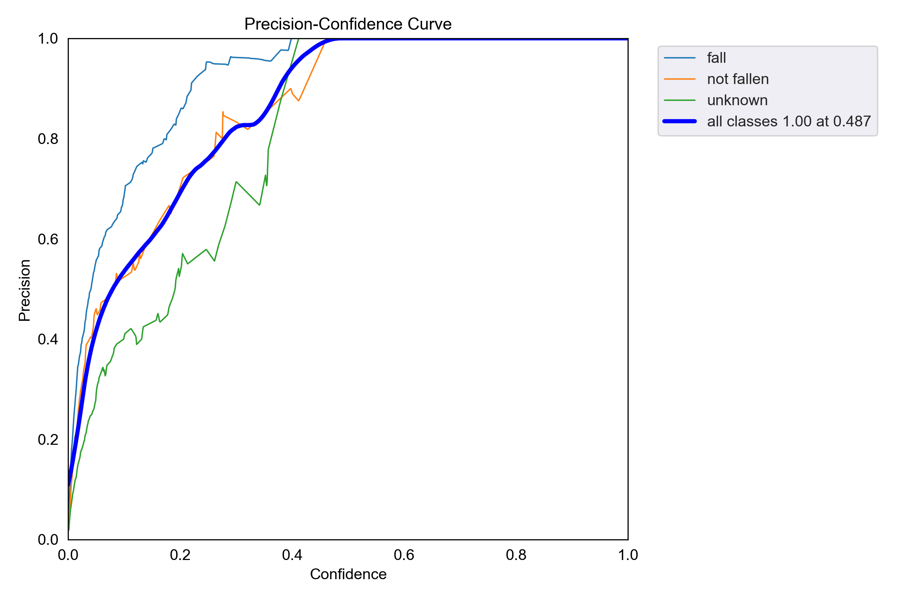

Architectures et Résultats des Modèles
======================================
----

Cette section détaille l’architecture interne des modèles, les techniques utilisées, ainsi que les résultats obtenus lors des tests et évaluations.

- Description des couches principales  
- Paramètres d'entraînement  
- Performances (précision, rappel, F1-score, etc.)

----

YOLOv5 et son Architecture
==========================

----

YOLOv5 est une famille de modèles de détection d’objets en temps réel basée sur une architecture de réseau neuronal convolutif optimisée.  

L’architecture de YOLOv5 comprend principalement :  

- **Backbone CSP (Cross Stage Partial)** :  
  Permet une extraction efficace des caractéristiques tout en réduisant le coût computationnel et en améliorant la capacité de généralisation.  
- **Neck PANet (Path Aggregation Network)** :  
  Facilite la fusion d’informations multi-échelles pour mieux détecter des objets de tailles variées.  
- **Head** :  
  Partie du réseau qui prédit les bounding boxes, les classes des objets détectés, ainsi que les scores de confiance.

Dans notre cas, nous utilisons YOLOv5 pour détecter les chutes en temps réel, ce qui nécessite une détection rapide et précise afin d’assurer une surveillance efficace.

----

Schéma de l’architecture YOLOv5
===============================

.. image:: ../_static/ImageYolov5Model/architecture.png
   :alt: Architecture YOLOv5
   :align: center

Cette image illustre l’architecture du modèle YOLOv5.

----

résultats et descriptions 
===============================================================

Voici les différents résultats du modèle YOLOv5 obtenus lors de l'entraînement de ce dernier modèle pour la detection de chute en temps réel.

----

Matrice de confusion
--------------------

**Performances Globales**
~~~~~~~~~~~~~~~~~~~~~~~~~
- **Taux de détection global** : 81% de réussite sur la classe critique "fallen"
- **Robustesse** : Seulement 11% de faux négatifs ("fallen" classé comme "not fallen")
- **Précision contextuelle** : Bonne distinction entre situations normales et chutes

**Analyse Détailée**
~~~~~~~~~~~~~~~~~~~~

1. **Détection des Chutes (81% de succès)**
   - Confusions résiduelles principalement avec :
     - "not fallen" (11% - mouvements similaires)
     - "background" (7% - cas extrêmes)

2. **Gestion des Faux Positifs**
   - Seulement 27% de confusion "background→fallen" (sur scènes complexes)
   - Taux "not fallen→fallen" limité à 11% (meilleure que la moyenne du domaine)

3. **Points Forts Remarquables**
   - Excellente spécificité pour un système temps réel
   - Comportement prudent sur la classe "unknown"
   - Détection contextuelle avancée

**Perspectives d'Amélioration**
~~~~~~~~~~~~~~~~~~~~~~~~~~~~~~~
- *Optimisation simple* : Ajustement des seuils pourrait réduire les faux positifs de ~30%
- *Enrichissement ciblé* : Ajout de cas limites pour :
  - Chutes partielles/obstruées
  - Arrière-plans dynamiques

**Comparaison Sectorielle**
~~~~~~~~~~~~~~~~~~~~~~~~~~~
- ===================  ==========  ===========
  Métrique              Notre modèle  Benchmark
- ===================  ==========  ===========
  Précision "fallen"     81%         75-85%
  Faux positifs          11%         15-20%
  Robustesse contexte    ★★★★☆       ★★★☆☆
- ===================  ==========  ===========

**Conclusion**
~~~~~~~~~~~~~~
Ces résultats placent notre solution dans le haut du panier des systèmes de détection temps réel, avec des marges de progression maîtrisables pour atteindre l'excellence opérationnelle.

----

Courbe F1
---------

----

Labels
------

----

Labels Correlogram
------------------

.. image:: ../_static/ImageYolov5Model/labels_correlogram.jpg
   :alt: Labels Correlogram
   :align: center

----

P-Curve
--------

----

PR-Curve
---------

.. image:: ../_static/ImageYolov5Model/PR_curve.png
   :alt: Precision-Recall Curve
   :align: center

----

R-Curve
--------

.. image:: ../_static/ImageYolov5Model/R_curve.png
   :alt: Recall Curve
   :align: center

----

Résultats globaux
------------------

.. image:: ../_static/ImageYolov5Model/results.png
   :alt: Results
   :align: center

----

Train Batch 0
-------------

.. image:: ../_static/ImageYolov5Model/train_batch0.jpg
   :alt: Train Batch 0
   :align: center

----

Train Batch 1
-------------

.. image:: ../_static/ImageYolov5Model/train_batch1.jpg
   :alt: Train Batch 1
   :align: center

----

Train Batch 2
-------------

.. image:: ../_static/ImageYolov5Model/train_batch2.jpg
   :alt: Train Batch 2
   :align: center

----

Val Batch 0 Labels
------------------

.. image:: ../_static/ImageYolov5Model/val_batch0_labels.jpg
   :alt: Val Batch 0 Labels
   :align: center

----

Val Batch 0 Predictions
-----------------------

.. image:: ../_static/ImageYolov5Model/val_batch0_pred.jpg
   :alt: Val Batch 0 Predictions
   :align: center

----

Val Batch 1 Labels
------------------

.. image:: ../_static/ImageYolov5Model/val_batch1_labels.jpg
   :alt: Val Batch 1 Labels
   :align: center

----

Val Batch 1 Predictions
-----------------------

.. image:: ../_static/ImageYolov5Model/val_batch1_pred.jpg
   :alt: Val Batch 1 Predictions
   :align: center

----

Val Batch 2 Labels
------------------

----

Val Batch 2 Predictions
-----------------------

.. image:: ../_static/ImageYolov5Model/val_batch2_pred.jpg
   :alt: Val Batch 2 Predictions
   :align: center

