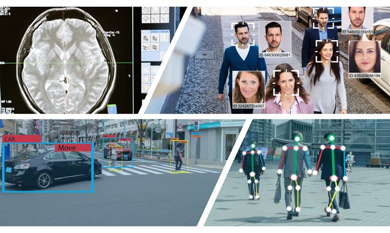

I. Introduction
===============

Objectif du Projet
------------------

Ce projet vise à concevoir un **système de surveillance intelligent** reposant sur la **vision par ordinateur**, avec pour principal objectif de garantir la sécurité des personnes vulnérables, notamment les personnes âgées, les patients ou toute autre population à risque.

Trois modèles d’intelligence artificielle complémentaires sont intégrés dans ce système :

- **Détection de chutes** (basée sur *YOLOv5*) : Permet de repérer instantanément une chute via le flux vidéo en temps réel.
- **Prédiction de chutes** (basée sur *LSTM + CNN*) : Analyse les séquences vidéo pour anticiper un risque imminent de chute, en combinant la reconnaissance de motifs temporels (*LSTM*) et spatiaux (*CNN*).
- **Détection de somnolence** (basée sur *CNN*) : Détecte les signes de fatigue ou de somnolence tels que les yeux fermés ou la tête inclinée.

Ce projet a pour ambition d’**améliorer la sécurité et la qualité de vie des personnes âgées**, en intervenant de manière préventive et réactive face aux situations critiques.

Par ailleurs, plusieurs **technologies de pointe** seront mises en œuvre : traitement d’image en temps réel, apprentissage profond (*deep learning*), architectures de réseaux de neurones (CNN, LSTM), intégration logicielle, et interfaces interactives.

Ce projet est développé par **Souleymane Diallo** et **Hinimdou Morsia Guitdam**, deux jeunes passionnés par l’**apprentissage automatique** et souhaitant approfondir leur maîtrise de la **vision par ordinateur** à travers une réalisation concrète et utile.

Illustration du Projet
----------------------

